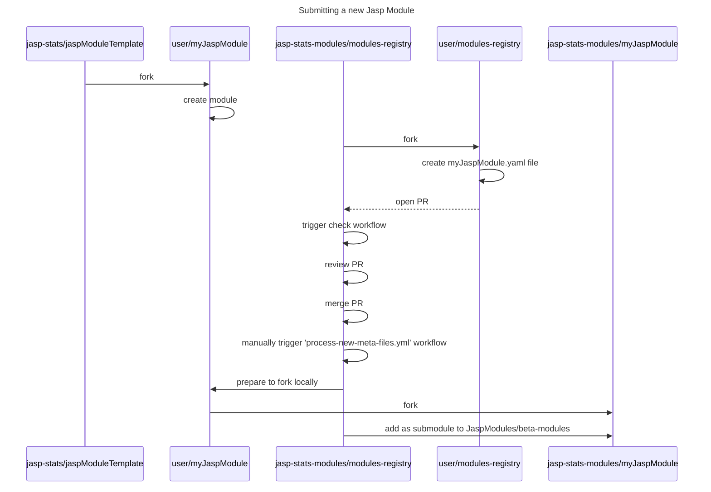

## Dev notes

- JASP modules are first describes in a `yaml` file under `modules-metadata` directory. This file contains the module's name, description, and the path to the module's source code as shown in this snippet:

```yaml
name: "ModuleName"
gitUrl: "Your JASP module git repository"
```

- When a PR is opened a git workflow triggers, `check-meta-files`, where checks can be added.
- Merging will only add the new `yaml` file to the `modules-metadata` directory on `main` branch.
- To fork and create submodules the workflow `process-new-meta-files` should be triggered manually.
- The `process-new-meta-files` workflow need a PAT with organization content write permissions and saved in organization secret `ORG_PAT`.
- The `process-new-meta-files` workflow will parse the `yaml` files and create forks of the remote JASP modules locally. It will also add submodules to the the `beta-modules` folder.

### Sequence diagram


